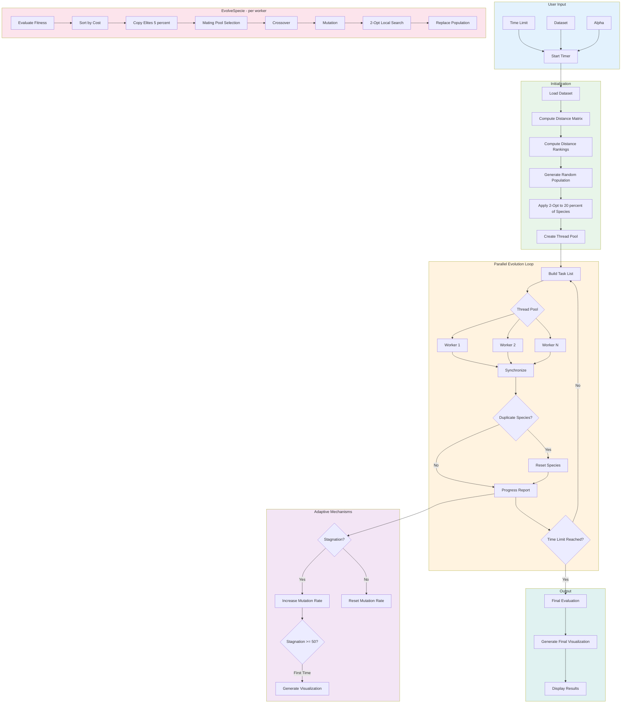

# Ring-Station Genetic Algorithm Optimizer

A high-performance, multi-threaded **genetic algorithm** in pure C for solving the **Ring Star Problem (RSP)**. Features parallel evolution, adaptive mutation, 2-opt local search, and real-time HTML visualization.

## Problem Description

Given a set of **N stations** with coordinates, find an optimal subset forming an **active ring** (closed tour). Stations not in the ring are assigned to their nearest ring station.

**Objective**: Minimize total cost = Ring Distance + alpha x Assignment Cost

Where **alpha** controls the trade-off between ring compactness and assignment distances.

```
        o Station 43 (assigned to ring)
         \
          \  (assignment cost)
           \
    *-------*-------*
   /         Ring    \
  *                   *
   \                 /
    *-------*-------*
             \
              \  (assignment cost)
               \
                o Station 17 (assigned to ring)

* = Ring node
o = Non-ring node (assigned to nearest ring node)
```

## Quick Start

```bash
# Run the optimizer
./Optimisation_Combinatoire_Genetique.exe

# Interactive prompts:
# Time limit in seconds (e.g., 58): 58
# Available datasets: 51, 100, 127, 225
# Dataset number: 127
# Alpha (3, 5, 7, 9): 5
```

## Algorithm Overview



## Key Features

### Multi-Species Parallel Evolution
- **30 independent species** evolving in parallel
- **Thread pool** with atomic task distribution
- No thread creation overhead per generation

### Adaptive Mutation Rate

| Stagnation | Mutation Rate | Strategy |
|------------|---------------|----------|
| 0-19 | 30% to 50% | Exploitation |
| 20-49 | 50% to 70% | Exploration |
| 50+ | 70% to 90% | Escape local optima |
| Improvement | Reset to 30% | Exploit new area |

### Diversity Maintenance
- **Duplicate detection**: Species with identical costs are reset
- **Random reinitialization**: Full random restart (no 2-opt) for diversity

### 2-Opt Local Search
- **Exhaustive** mode for initialization (20% of species)
- **Adaptive** mode during evolution (random window, limited improvements)

### Real-Time Visualization
HTML/SVG visualization generated:
1. When stagnation reaches 50 (first time)
2. At the end of the time limit

## Project Structure

```
├── main.c                          # Entry point, user input, main loop
├── core/
│   ├── Individual.h/c              # Individual with cost caching
│   └── Node.h/c                    # Station data structure
├── evolution/
│   └── EvolveSpecie.h/c            # Single generation evolution
├── genetic/
│   ├── Crossover.h/c               # Slice crossover (depot-safe)
│   ├── Mutation.h/c                # 5 mutation types (depot-safe)
│   └── Selection.h/c               # Mating pool selection
├── local_search/
│   └── TwoOpt.h/c                  # Adaptive and exhaustive 2-opt
├── cost/
│   └── Cost.h/c                    # Ring + assignment cost
├── generation/
│   └── PopulationInit.h/c          # Random population generation
├── utils/
│   ├── ThreadPool.h/c              # Windows thread pool
│   ├── Distance.h/c                # Distance matrix and ranking
│   ├── Visualize.h/c               # HTML/SVG generation
│   ├── Random.h/c                  # RNG utilities
│   ├── FileIO.h/c                  # Dataset loading
│   └── main_helpers.h/c            # CLI, reporting, mutation adaptation
├── data/
│   ├── 51/51_data.txt              # 51 stations
│   ├── 100/100_data.txt            # 100 stations
│   ├── 127/127_data.txt            # 127 stations
│   └── 225/225_data.txt            # 225 stations
└── images/                         # Generated visualizations (gitignored)
```

## Benchmark Results

| Dataset | Alpha | Best Known |
|---------|-------|------------|
| 51 | 3 | 1,278 |
| 51 | 5 | 1,995 |
| 51 | 7 | 2,113 |
| 51 | 9 | 1,244 |
| 100 | 3 | 63,846 |
| 100 | 5 | 100,785 |
| 100 | 7 | 115,388 |
| 100 | 9 | 94,265 |
| 127 | 3 | 354,846 |
| 127 | 5 | 539,955 |
| 127 | 7 | 567,110 |
| 127 | 9 | 347,845 |

## Build

### Visual Studio
1. Open `Optimisation_Combinatoire_Genetique.sln`
2. Build in **Release** mode for best performance

### Command Line (MSVC)
```bash
cl /O2 /MT main.c core\*.c evolution\*.c genetic\*.c cost\*.c generation\*.c local_search\*.c utils\*.c /Fe:optimizer.exe
```

## Configuration

Default parameters in `main.c`:

```c
int num_species = 30;           // Number of parallel species
int pop_size = 200;             // Individuals per species
double mutation_rate = 0.30;    // Initial mutation rate
int elitism = 5%;               // Top individuals preserved
int log_interval = 150;         // Generations between reports
```

Command line options:

```bash
optimizer.exe -g 5000 -s 50 -p 100 -t 8 --logs --timers
```

| Option | Description |
|--------|-------------|
| `-g N` | Max generations |
| `-s N` | Number of species |
| `-p N` | Population size |
| `-t N` | Thread count (0 = auto) |
| `--logs` | Detailed evolution logs |
| `--timers` | Performance timing |

## Output Example

```
============================================
  GENETIC ALGORITHM - RING OPTIMIZATION
============================================

Time limit in seconds (e.g., 58): 58
Dataset number: 127
Alpha (3, 5, 7, 9): 5

[CONFIG]
  Time limit:  58.0 seconds
  Dataset:     data\127\127_data.txt
  Alpha:       5
  Species:     30
  Population:  200 per species

[STEP 4] Initializing population...
         30 species x 200 individuals (45.2 ms)
         Applying 2-Opt (exhaustive) to 20% of species...

[GENERATION 150]
  Top 5 species:
    1. Species  12: cost = 542156.32
    2. Species   5: cost = 543892.11
    ...
  Best: cost=542156.32 (species 12, individual 45)
  No improvement (stagnation: 15)
  Mutation rate increased to 0.375

[TIME LIMIT] Stopped after 58.0 seconds (2847 generations)

============================================
  DATASET: 127 stations (alpha=5)
  GENERATIONS: 2847
  BEST COST: 541234.56
  TOTAL TIME: 58.0 seconds
============================================
```

## Visualization

Generated HTML files show:
- Ring nodes (blue) with connections
- Non-ring nodes (gray) with assignment lines
- Depot node (green)
- Complete ring path
- All assignments (Station X assigned to Ring Node Y)

## Notes

- **Windows-only**: Uses Windows threading APIs
- **Depot constraint**: Node 1 is always in the ring (enforced in crossover and mutation)
- **Memory efficient**: Stack allocation for small arrays, cost caching

## License

MIT License
