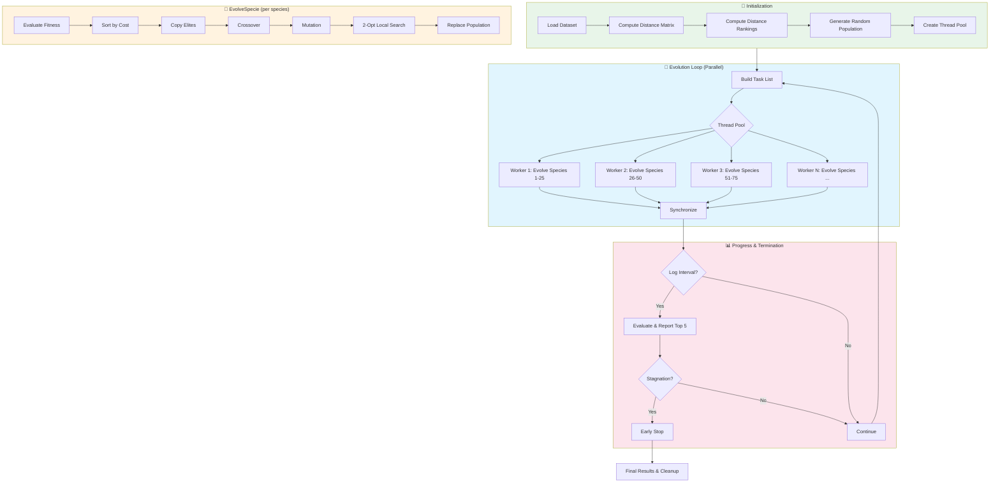

# Ring-Station Genetic Algorithm Optimizer

A high-performance, multi-threaded genetic algorithm implementation in C for solving the Ring Scheduling Problem (RSP). This project demonstrates practical optimization techniques including parallel processing, memory-efficient data structures, and local search improvements.

## Problem Description

Given a set of stations (nodes with coordinates), find an optimal subset forming an "**active ring**" (a closed tour). Every station not in the ring is assigned to its nearest ring station. The objective is to minimize a weighted combination of:
- **Ring cost**: Total distance traveled around the ring
- **Assignment cost**: Total distance from non-ring stations to their assigned ring stations

## Algorithm Overview



## Performance Optimizations

### 1. Multi-Threading with Thread Pool

**Problem**: Creating threads is expensive (~0.5-1ms per thread on Windows). With 100 species × 1000 generations, naive threading would waste 50-100 seconds just on thread creation.

**Solution**: Producer-consumer thread pool pattern:
- Workers are created **once** at startup
- Each generation, workers are **woken up** via semaphore
- Workers grab tasks **atomically** using `InterlockedIncrement`
- Workers **sleep** when done (not destroyed)

```
Main Thread                      Worker Threads
     │                                │
     │  ThreadPool_Init()             │
     │  Create N workers ──────────►  │ (workers wait on semaphore)
     │                                │
     │  ThreadPool_Run(tasks)         │
     │  ReleaseSemaphore(N) ───────►  │ Workers wake up!
     │  WaitForSingleObject() ◄────┐  │ 
     │  (blocks)                   │  │ Workers execute tasks
     │                             │  │ Last one: SetEvent() ──┘
     │  Returns                       │
     │                                │ Workers go back to sleep
```

**See**: `utils/ThreadPool.c` for detailed implementation with extensive comments.

### 2. Stack Allocation for Small Arrays

**Problem**: `malloc`/`free` are relatively slow and cause heap fragmentation in hot loops.

**Solution**: Use stack-allocated buffers for small arrays:

```c
#define MAX_STACK_SIZE 256
int stack_buffer[MAX_STACK_SIZE];
int* array;

if (size <= MAX_STACK_SIZE) {
    array = stack_buffer;  // Fast: no malloc
} else {
    array = malloc(size * sizeof(int));  // Fallback for large arrays
}
```

**Used in**: `Cost.c`, `Crossover.c`, `Mutation.c`

### 3. Precomputed Distance Matrix & Rankings

**Problem**: Computing distances repeatedly is O(1) per lookup but the Euclidean distance formula is expensive.

**Solution**: Precompute everything once:
- **Distance Matrix** (`double**`): O(n²) space, O(1) lookup
- **Distance Rankings** (`int**`): For each station, neighbors sorted by distance

```c
// Instead of: sqrt((x1-x2)² + (y1-y2)²) every time
// Just do: dist[station_a][station_b]
```

### 4. Cost Caching

**Problem**: Cost computation (ring cost + assignment cost) is expensive and often redundant.

**Solution**: Cache cost in each Individual:

```c
typedef struct {
    int* active_ring;
    int ring_size;
    double cached_cost;  // Set to 1e18 when invalid
} Individual;

// In evaluation:
if (ind->cached_cost < 1e17) {
    return ind->cached_cost;  // Cache hit!
} else {
    double cost = compute_cost(ind);
    ind->cached_cost = cost;  // Cache for next time
    return cost;
}
```

### 5. 2-Opt Local Search

Each offspring is improved using 2-opt: iteratively reverse ring segments that reduce total distance.

```
Before:  A ─── B       C ─── D
              ╲       ╱
               ╲     ╱
                ╳   (crossing = bad)
               ╱     ╲
              ╱       ╲
         
After:   A ─── C       B ─── D  (uncrossed = shorter)
```

### 6. Atomic Task Distribution

Workers grab tasks using lock-free atomic operations:

```c
// No locks needed! InterlockedIncrement is atomic.
LONG task_idx = InterlockedIncrement(&g_next_task) - 1;
if (task_idx < g_task_count) {
    execute(tasks[task_idx]);
}
```

## File Structure

```
├── main.c                      # Entry point, orchestration (clean & minimal)
├── core/
│   ├── Individual.h/c          # Individual representation with cost caching
│   └── Node.h/c                # Station/node data structure
├── evolution/
│   └── EvolveSpecie.h/c        # One generation of evolution (with timers)
├── genetic/
│   ├── Crossover.h/c           # Slice crossover operator
│   ├── Mutation.h/c            # Add, remove, swap, inversion, scramble
│   └── Selection.h/c           # Tournament selection, best selection
├── local_search/
│   └── TwoOpt.h/c              # 2-opt local search improvement
├── cost/
│   └── Cost.h/c                # Ring cost + assignment cost calculation
├── generation/
│   └── PopulationInit.h/c      # Random population generation
├── utils/
│   ├── ThreadPool.h/c          # Thread pool (extensively commented!)
│   ├── Distance.h/c            # Distance matrix & ranking computation
│   ├── Random.h/c              # Random number generation
│   ├── FileIO.h/c              # Dataset loading
│   ├── main_helpers.h/c        # CLI parsing, reporting
│   └── hierarchy_and_print_utils.h/c  # SVG visualization
└── data/
    ├── 51/51_data.txt          # 51-station dataset
    ├── 100/100_data.txt        # 100-station dataset
    └── 127/127_data.txt        # 127-station dataset
```

## Build

### Windows / Visual Studio

1. Open `OptimisationCombinatoire.sln` in Visual Studio
2. Build in `Release` configuration for best performance

### Command Line (MSVC)

```bash
cl /O2 /MT main.c utils\*.c evolution\*.c genetic\*.c cost\*.c generation\*.c local_search\*.c core\*.c /Fe:rsp_optimizer.exe
```

### Cross-Platform Note

This implementation uses Windows-specific threading APIs:
- `_beginthreadex`, `WaitForSingleObject`, `CreateSemaphore`, etc.

For POSIX systems, you would need to replace these with pthread equivalents:
- `pthread_create` / `pthread_join`
- `sem_wait` / `sem_post`
- `pthread_cond_wait` / `pthread_cond_signal`

## Usage

```bash
# Basic run (uses all CPU cores)
rsp_optimizer.exe

# Custom parameters
rsp_optimizer.exe -g 2000 -s 50 -p 40 -t 4

# With timing information
rsp_optimizer.exe --timers

# With detailed logs
rsp_optimizer.exe --logs
```

### Command Line Options

| Option | Description | Default |
|--------|-------------|---------|
| `-g N` | Maximum generations | 10000 |
| `-s N` | Number of species | 100 |
| `-p N` | Population size per species | 50 |
| `-t N` | Number of worker threads (0 = auto) | auto |
| `-l N` | Log/report interval | 50 |
| `-v` | Verbose mode | off |
| `--logs` | Enable detailed evolution logs | off |
| `--timers` | Enable performance timers | off |

## Timer Output Example

With `--timers` enabled, you'll see detailed timing for each evolution step:

```
[EVOLVE TIMERS]
  Evaluation:    0.45 ms
  Sorting:       0.02 ms
  Crossover:     0.31 ms (total for 50 offspring)
  Mutation:      0.18 ms
  2-Opt:         1.23 ms
  Replace:       0.05 ms
  TOTAL:         2.24 ms
```

This helps identify bottlenecks. In this example, 2-Opt dominates - you might want to reduce iterations or apply it less frequently.

## Performance Tips

1. **Use Release build**: Debug builds are 10-50x slower
2. **Match threads to cores**: More threads than cores adds overhead
3. **Adjust species/population**: More species = more parallelism, but diminishing returns
4. **Watch for stagnation**: Algorithm auto-stops after 50 generations without improvement
5. **Use `--timers`**: Identify which phase is the bottleneck

## License

See repository metadata.

---

*This README reflects the optimized, multi-threaded implementation with detailed comments explaining Windows threading primitives and their C++ equivalents.*
