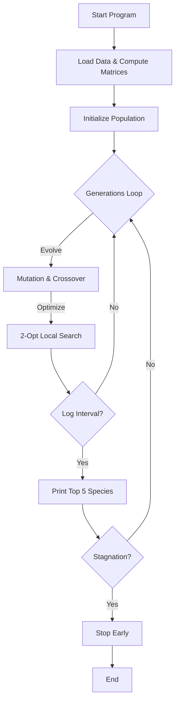

# Ring-Station Genetic Algorithm Optimizer

A compact, high-performance genetic algorithm implementation for the Ring Scheduling Problem (RSP). This repository contains a readable C implementation focused on clarity and practical optimizations (precomputed distances, simple multithreading, and modular code organization).

## What this project does

Given a set of stations (nodes with coordinates), the algorithm searches for a subset forming an "active ring" (a closed tour). Every other station is assigned to its closest ring station. The objective is to minimize a combination of ring tour length and assignment cost.

Key features
- Classical genetic algorithm: crossover, multiple mutation operators, selection and optional elitism
- Local improvements (2-opt) and smart node insertion
- Precomputed distance matrix and ranking for fast lookups
- Optional thread pool to evolve species in parallel
- Readable, modular C code intended for easy modification

## Current status (what changed)
- `main.c` was refactored to be more readable and to keep the evolution loop clear.
- CLI parsing and the detailed reporting logic were moved to `utils/main_helpers.c/.h` for clarity.
- Thread-pool and worker logic remain in `main.c` (can be moved to its own module if desired).
- Several helper modules (cost, evolution, genetic operators, distance, IO) remain in their original folders.


## Build

Windows / Visual Studio

1. Open `OptimisationCombinatoire.sln` in Visual Studio and build the `Release` configuration.

Cross-platform (gcc/clang)

```bash
# from repository root
gcc -O3 -std=c11 \
    main.c generation/*.c utils/*.c evolution/*.c cost/*.c genetic/*.c -o rsp_optimizer
```

Note: Some files use Windows-specific threading APIs (`<windows.h>` and `_beginthreadex`). To compile on POSIX systems you will need to port the thread code or use a preprocessor wrapper.

## Run

Basic run (expects a data file under the `data/` folder):

```bash
./rsp_optimizer
```

Common CLI options
- `-g <N>`  – set max generations (example: `-g 1000`)
- `-s <N>`  – number of species
- `-p <N>`  – population size per species
- `-t <N>`  – start thread pool with N workers (0 = single-threaded)
- `-v`      – verbose logging
- `-l <N>`  – log/report interval in generations

Example:

```bash
./rsp_optimizer -g 2000 -s 50 -p 40 -t 4 -v
```

## File layout (important files)

- `main.c` — program entry, main evolution loop, thread-pool/worker implementation
- `utils/main_helpers.h` and `utils/main_helpers.c` — CLI parsing, timestamp printing, and detailed evaluation/reporting helpers (kept simple and serial for readability)
- `core/Individual.h` — individual representation
- `core/Node.h` — node/station definition
- `generation/` — population initialization
- `utils/Distance.c/h` — distance matrix and ranking utilities
- `evolution/` — `EvolveSpecie` implementation and evolution operators orchestration
- `genetic/` — selection, crossover and mutation operators
- `cost/` — cost evaluation functions
- `data/` — datasets (e.g. `data/127/127_data.txt`)

## Notes for developers
- The code is intentionally modular. If you prefer more separation, move the thread-pool (`pool_*` functions and `pool_worker`) into `utils/thread_pool.c/h` and keep only orchestration in `main.c`.
- The detailed evaluation helper in `utils/main_helpers.c` is serial to keep it simple to read. If you want parallel evaluation, reintroduce a clear worker bookkeeping mechanism (avoid hidden reliance on global counters).
- Many functions expect `double**` distance matrices and `int**` rankings; use `Free_2DArray_Double` / `Free_2DArray_Int` when freeing.

## Troubleshooting
- If the program fails to read data, check the path `data/<dataset>/<file>`. The default in `main.c` is `data\127\127_data.txt`.
- On non-Windows platforms you will need to replace Windows threading primitives (`CreateEvent`, `WaitForSingleObject`, `SetEvent`, `_beginthreadex`) with pthreads or a cross-platform abstraction.

## License & Authors
See repository metadata.

---

This `ReadMe.md` is the canonical README for this workspace. Other stray `.md`/`.txt` files are not authoritative and can be removed if you prefer a single README. If you want, I can remove or consolidate them next.
